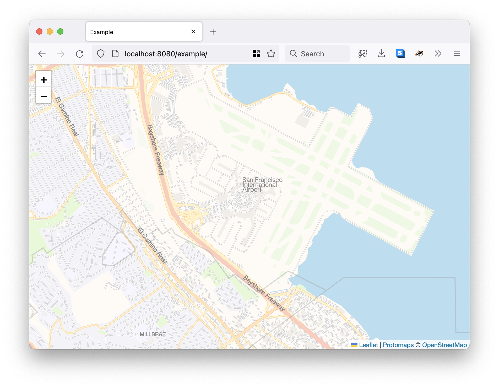
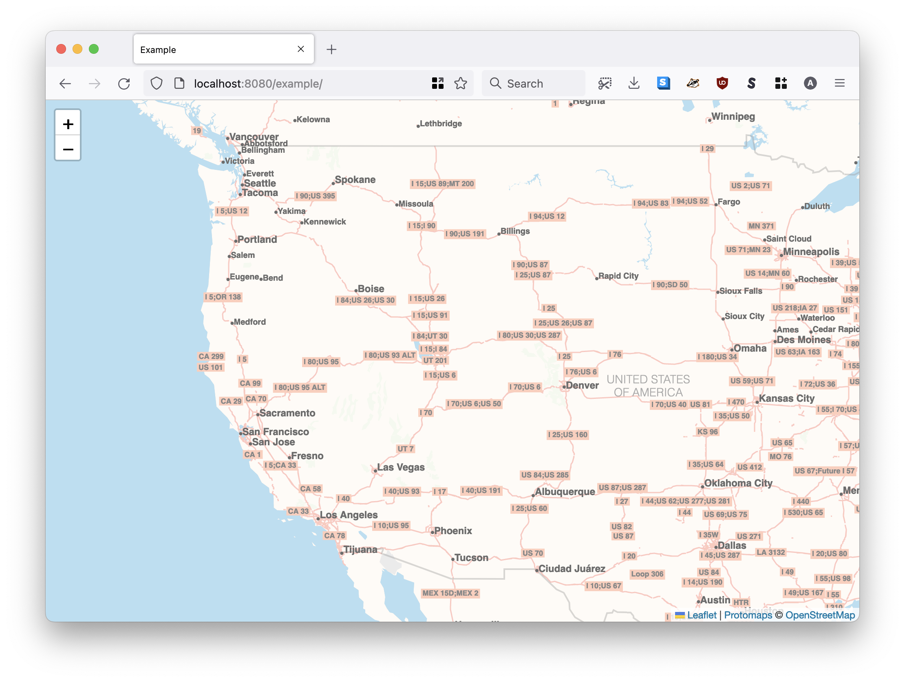

# go-sfomuseum-pmtiles

SFO Museum specific package for working with Protomaps (v3) databases.

## Documentation

Documentation is incomplete at this time.

## Tools

```
$> make cli
go build -mod vendor -o bin/server cmd/server/main.go
```

### server

```
$> ./bin/server -h
  -cache-size int
    	Cache size in megabytes for tiles. (default 64)
  -cors-allow-credentials
    	Enable support for credentials in CORS requests.
  -cors-debug
    	Enable debugging in the rs/cors package.
  -cors-origin value
    	One or more comma-separated lists of hosts to enable CORS support for. If the -enable-cors flag is set and no -cors-origin flags have been assigned then CORS support will be enabled for '*'.
  -enable-cors
    	Enable CORS support.
  -enable-example
    	Enable an example map application at /example for testing database files. 
  -example-database string
    	The name of the database to use in the example map application. Note that this value should be the name of the database without its extension.
  -example-latitude string
    	The starting latitude for the example map application. (default "37.6143")
  -example-longitude string
    	The starting longitude for the example map application. (default "-122.3828")
  -example-zoom string
    	The starting zoom for the example map application. (default "13")
  -server-uri string
    	A valid aaronland/go-http-server URI. (default "http://localhost:8080")
  -tile-path string
    	A valid gocloud.dev/blob bucket URI where .pmtiles databases are stored.
```

For example:

```
$> ./bin/server \
	-tile-path file:///usr/local/sfomuseum/tiles \
	-enable-example \
	-example-database sfo

2022/10/11 14:54:31 Listening for requests on http://localhost:8080
2022/10/11 14:54:37 fetching sfo 0-16384
2022/10/11 14:54:37 fetched sfo 0-0
2022/10/11 14:54:37 [200] served /sfo/11/328/792.mvt in 3.025132ms
2022/10/11 14:54:37 [200] served /sfo/11/327/792.mvt in 4.38898ms
2022/10/11 14:54:38 [200] served /sfo/12/656/1585.mvt in 322.892µs
2022/10/11 14:54:38 [200] served /sfo/12/654/1585.mvt in 7.676399ms
2022/10/11 14:54:38 [200] served /sfo/12/655/1585.mvt in 7.976492ms
2022/10/11 14:54:39 [200] served /sfo/13/1311/3170.mvt in 9.82361ms
...and so on
```



Or, with a PMTile database hosted on S3:

```
$> bin/server \
	-tile-path 's3blob://{BUCKET}?prefix={PREFIX}&region={REGION}&credentials={CREDENTIALS}' \
	-enable-example \
	-example-database \
	sfomuseum
```

_Note the syntax in which the bucket name is seperate from any leading prefix. I've wasted a lot of time not remembering this._



## See also

* https://github.com/protomaps/go-pmtiles
* https://github.com/aaronland/go-http-server
* https://gocloud.dev/blob